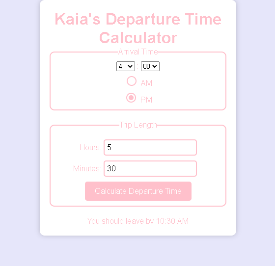

# Departure Time Calculator

## Description

This app is designed for a loved one who has dyscalculia, and it is also useful for those with time blindness. It calculates a departure time for a short trip once the user provides the desired arrival time and trip duration.

## Table of Contents

- [Usage](#usage)
- [License](#license)
- [Questions](#questions)

## Usage

Enter via drop down your desired arrival time and select AM or PM. Enter your trip duration and then hit the calculate button.

## License

MIT

## Questions

If you have any questions you can reach me at edrezner7@gmail.com. Visit my GitHub [edrezner](https://www.github.com/edrezner) to see more of my work.
